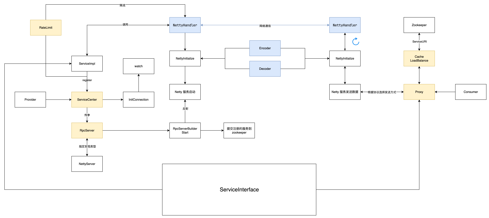

# Ryan RPC Framework


Ryan RPC 是一个基于 Java 17 的高性能、轻量级 RPC 框架，提供了服务注册与发现、负载均衡、熔断器、限流等分布式系统核心功能。该框架支持多种通信协议和序列化方式，具有良好的扩展性和易用性。

## 目录

- [项目概述](#项目概述)
- [功能特性](#功能特性)
- [架构设计](#架构设计)
- [模块说明](#模块说明)
- [核心组件](#核心组件)
  - [服务注册与发现](#服务注册与发现)
  - [网络通信](#网络通信)
  - [序列化](#序列化)
  - [负载均衡](#负载均衡)
  - [熔断器](#熔断器)
  - [限流器](#限流器)
- [快速开始](#快速开始)
- [使用示例](#使用示例)
- [配置说明](#配置说明)
- [路线图](#路线图)
- [许可证](#许可证)
## 项目概述

Ryan RPC 是一个高性能、可扩展的远程过程调用(RPC)框架，旨在简化分布式服务间的通信。它提供了完整的 RPC 解决方案，包括服务注册发现、负载均衡、容错处理等企业级特性。



## 技术栈

- **核心框架**: Java 17, Maven
- **网络通信**: Netty , Tomcat Embed 
- **服务发现**: Apache Curator  , Nacos Client 
- **序列化**: Fastjson, Hessian 
- **重试机制**: Guava Retrying 
- **日志**: Logback
- **工具**: Lombok, Commons-IO 

## 架构设计

Ryan RPC 采用分层架构设计，主要包括以下层次：

1. **API层**: 定义服务接口
2. **代理层**: 提供客户端代理和服务端代理
3. **通信层**: 实现网络通信(HTTP/Netty)
4. **序列化层**: 提供多种序列化方式
5. **注册中心层**: 实现服务注册与发现
6. **负载均衡层**: 提供多种负载均衡策略
7. **容错层**: 实现熔断和限流机制

## 模块说明

- `Consumer`: 服务消费者
- `Provider`: 服务提供者
- `Provider-Common`: 服务接口定义模块
- `ryanRpc`: 核心框架模块，包含所有核心功能实现

## 核心组件

### 服务注册与发现

支持三种服务注册中心实现：

- `LocalServiceCenter`: 本地服务注册中心，适用于单机测试
- `ZKCenter`: 基于 ZooKeeper 的分布式服务注册中心
- `NacosCenter`: 基于 Nacos 的分布式服务注册中心

### 网络通信

提供两种通信协议实现：

- **HTTP协议**: 基于 Servlet 的 HTTP 服务端和客户端实现
- **Netty协议**: 基于 Netty 的高性能 TCP 服务端和客户端实现

### 序列化

支持三种序列化方式：

- **Java原生序列化**: `ObjectSerializer`
- **JSON序列化**: `JsonSerializer`
- **Hessian序列化**: `HessianSerializer`

### 负载均衡

提供三种负载均衡策略：

- **轮询**: `RoundLoadBalance`
- **随机**: `RandomLoadBalance`
- **一致性哈希**: `ConsistencyHashBalance`

### 熔断器

实现基于状态机模式的熔断器 `CircuitBreaker`，包含三种状态：

- **CLOSED**: 正常状态，允许请求通过
- **OPEN**: 熔断状态，拒绝所有请求
- **HALF_OPEN**: 半开状态，允许有限请求通过进行探测

### 限流器

提供三种限流实现：

- **无限制**: `NoRateLimit`
- **简单令牌桶**: `SimpleTokenBucketRateLimitImpl`
- **高级令牌桶**: `AdvancedTokenBucketRateLimitImpl`

## 包/文件功能说明

### 核心包结构

```
io.ryan
├── common                  # 公共模块
│   ├── constant            # 常量定义
│   ├── dto                 # 数据传输对象
│   └── Message             # 消息封装
├── protocol                # 通信协议模块
│   ├── client              # 客户端实现
│   │   ├── HttpClient      # HTTP客户端
│   │   └── NettyClientImpl # Netty客户端
│   ├── codec               # 编解码器
│   └── server              # 服务端实现
│       ├── HttpServerImpl  # HTTP服务端
│       └── NettServerImpl  # Netty服务端
├── proxy                   # 代理模块
├── provider                # 服务提供者模块
├── serviceCenter           # 服务注册中心模块
│   ├── cache               # 缓存实现
│   └── impl                # 具体实现
├── loadbalance             # 负载均衡模块
│   └── impl                # 具体实现
├── ratelimit               # 限流模块
│   └── impl                # 具体实现
├── circuitBreaker          # 熔断器模块
└── utils                   # 工具类模块
    └── Serializer          # 序列化工具

```

### 重要文件说明

#### 公共模块 (common)

- `common.Message.RpcRequest`: RPC请求封装类，包含接口名、方法名、参数类型和参数值
- `common.Message.RpcResponse`: RPC响应封装类，包含状态码、消息和返回数据
- `common.dto.ServiceURI`: 服务URI封装类，包含主机名、端口和协议信息
- `common.constant.RpcProtocol`: RPC协议常量定义（HTTP/TCP）
- `common.constant.SerializerType`: 序列化类型常量定义

#### 通信协议模块 (protocol)

- `protocol.server.RpcServer`: RPC服务端接口，定义启动和获取协议方法
- `protocol.client.RpcClient`: RPC客户端接口，定义发送请求方法
- `protocol.server.HttpServerImpl.HttpServer`: HTTP服务端实现
- `protocol.server.NettServerImpl.NettyServer`: Netty服务端实现
- `protocol.client.HttpClient.HttpClientImpl`: HTTP客户端实现
- `protocol.client.NettyClientImpl.NettyClient`: Netty客户端实现
- `protocol.codec.SimpleDecoder/SimpleEncoder`: 简单编/解码器

#### 服务注册中心模块 (serviceCenter)

- `serviceCenter.ServiceCenter`: 服务注册中心接口，定义服务注册、发现等方法
- `serviceCenter.impl.LocalServiceCenter`: 本地服务注册中心实现
- `serviceCenter.impl.zooKeeperImpl.ZKCenter`: ZooKeeper服务注册中心实现
- `serviceCenter.impl.nacosImpl.NacosCenter`: Nacos服务注册中心实现
- `serviceCenter.cache.ServiceCache`: 服务缓存实现

#### 代理模块 (proxy)

- `proxy.ProxyFactory`: 动态代理工厂类，创建服务接口的代理实例

#### 服务提供者模块 (provider)

- `provider.ServiceProvider`: 服务提供者管理类，注册和获取服务实例

#### 负载均衡模块 (loadbalance)

- `loadbalance.LoadBalance`: 负载均衡接口，定义选择策略方法
- `loadbalance.impl.RoundLoadBalance`: 轮询负载均衡实现
- `loadbalance.impl.RandomLoadBalance`: 随机负载均衡实现
- `loadbalance.impl.ConsistencyHashBalance`: 一致性哈希负载均衡实现

#### 限流模块 (ratelimit)

- `ratelimit.RateLimit`: 限流接口，定义获取令牌方法
- `ratelimit.impl.NoRateLimit`: 无限制实现
- `ratelimit.impl.SimpleTokenBucketRateLimitImpl`: 简单令牌桶限流实现
- `ratelimit.impl.AdvancedTokenBucketRateLimitImpl`: 高级令牌桶限流实现
- `ratelimit.RateLimitRegistry`: 限流器注册表

#### 熔断器模块 (circuitBreaker)

- `circuitBreaker.CircuitBreaker`: 熔断器实现，包含CLOSED、OPEN、HALF_OPEN三种状态
- `circuitBreaker.CircuitBreakerProvider`: 熔断器提供者

#### 序列化模块 (utils.Serializer)

- `utils.Serializer.Serializer`: 序列化接口，定义序列化和反序列化方法
- `utils.Serializer.ObjectSerializer`: Java原生序列化实现
- `utils.Serializer.JsonSerializer`: JSON序列化实现
- `utils.Serializer.HessianSerializer`: Hessian序列化实现

## 快速开始

### 环境要求

- Java 17 或更高版本
- Maven 3.6 或更高版本
- ZooKeeper 3.6+ (可选，用于分布式服务注册)

### 安装依赖

确保你的系统中已安装 Java 17 和 Maven：

```bash
# 检查 Java 版本
java -version

# 检查 Maven 版本
mvn -version
```

### 启动 ZooKeeper (可选)

如果你想使用 ZooKeeper 作为服务注册中心，需要先启动 ZooKeeper：

```bash
version: '3.8'

services:
  zookeeper:
    image: zookeeper:3.9
    container_name: zookeeper
    restart: always
    ports:
      - "2181:2181"
    environment:
      ZOOKEEPER_CLIENT_PORT: 2181
      ZOOKEEPER_TICK_TIME: 2000
```

### 启动Nacos (可选)

```
version: '3.8'

services:
  nacos:
    image: nacos/nacos-server:v2.4.3
    container_name: nacos
    ports:
      - "127.0.0.1:8848:8848"
      - "127.0.0.1:9848:9848"
    environment:
      - MODE=standalone
    volumes:
      - ./data:/home/nacos/data
    restart: unless-stopped

```


### 构建项目

```bash
# 克隆项目
git clone https://github.com/Rain-kl/ryan-rpc.git
cd ryan-rpc

# 编译项目
mvn clean install
```

### 运行示例

1. 导入项目到 IntelliJ IDEA 或 Eclipse
2. 运行 `Provider/src/main/java/io/ryan/Main.java`
3. 运行 `Consumer/src/main/java/io/ryan/Main.java`

### 验证运行结果

如果一切正常，你应该在消费者控制台看到类似输出：

```
Hello world, Ryan 0! This is a response from the provider.
Hello world, Ryan 1! This is a response from the provider.
...
```

## 使用示例

### 1. 定义服务接口

首先在 `Provider-Common` 模块中定义服务接口：

```java
package io.ryan.service;

public interface HelloService {
    String sayHello(String name);
}
```

### 2. 实现服务

在 `Provider` 模块中实现服务接口：

```java
package io.ryan.serviceImpl;

import io.ryan.service.HelloService;

public class HelloServiceImpl implements HelloService {
    @Override
    public String sayHello(String name) {
        return "Hello world, " + name + "! This is a response from the provider.";
    }
}
```

### 3. 服务提供者启动

```java
package io.ryan;

import io.ryan.protocol.server.NettServerImpl.NettyServer;
import io.ryan.protocol.server.RpcServerBuilder;
import io.ryan.ratelimit.impl.SimpleTokenBucketRateLimitImpl;
import io.ryan.serviceCenter.impl.zooKeeperImpl.ZKCenter;
import io.ryan.serviceImpl.HelloServiceImpl;

public class ProviderMain {
    public static void main(String[] args) {
        // 创建服务注册中心
        ZKCenter serviceCenter = new ZKCenter("localhost", 2181);
        
        // 配置全局限流器
        serviceCenter.setGlobalRateLimit(new SimpleTokenBucketRateLimitImpl(10, 10));
        
        // 注册服务
        serviceCenter.register(HelloServiceImpl.class, true);
        
        // 构建并启动服务器
        RpcServerBuilder.builder()
                .host("localhost")
                .port(8080)
                .rpcServer(NettyServer.class)
                .serviceCenter(serviceCenter)
                .build()
                .start();
    }
}
```

### 4. 服务消费者调用

```java
package io.ryan;

import io.ryan.proxy.ProxyFactory;
import io.ryan.service.HelloService;
import io.ryan.serviceCenter.impl.zooKeeperImpl.ZKCenter;

public class ConsumerMain {
    public static void main(String[] args) {
        // 设置服务注册中心
        ProxyFactory.setServiceCenter(new ZKCenter("localhost", 2181));
        
        // 获取服务代理
        HelloService helloService = ProxyFactory.getProxy(HelloService.class);
        
        // 调用远程服务
        String result = helloService.sayHello("Ryan");
        System.out.println(result);
        // 输出: Hello world, Ryan! This is a response from the provider.
    }
}
```

### 5. 高级配置示例

#### 配置限流器

```java
// 创建高级令牌桶限流器
AdvancedTokenBucketRateLimitImpl rateLimiter = 
    new AdvancedTokenBucketRateLimitImpl(100, 100);

// 为特定服务设置权重
rateLimiter.setWeight(HelloServiceImpl.class, 2);

// 注册服务时指定限流器
serviceCenter.register(HelloServiceImpl.class, true, rateLimiter);
```

#### 配置负载均衡

```java
// 可以通过配置选择不同的负载均衡策略
// 1. 轮询负载均衡 (默认)
// 2. 随机负载均衡
// 3. 一致性哈希负载均衡
```

#### 使用不同的通信协议

```java
// 使用 HTTP 协议
RpcServerBuilder.builder()
    .host("localhost")
    .port(8080)
    .rpcServer(HttpServer.class)  // 改为 HttpServer
    .serviceCenter(serviceCenter)
    .build()
    .start();
```

## 配置说明

### 服务注册中心配置

#### ZooKeeper 配置

```java
// 基本配置
ZKCenter serviceCenter = new ZKCenter("localhost", 2181);

// 高级配置（支持集群）
ZKCenter serviceCenter = new ZKCenter("zk1:2181,zk2:2181,zk3:2181", 2181);
```

#### 本地注册中心配置

```java
// 适用于单机测试环境
LocalServiceCenter serviceCenter = new LocalServiceCenter(LocalServiceCenter.Type.Server);
```

### 通信协议配置

#### Netty (TCP) 配置 (推荐用于生产环境)

```java
RpcServerBuilder.builder()
    .host("0.0.0.0")
    .port(8080)
    .rpcServer(NettyServer.class)
    .serviceCenter(serviceCenter)
    .build();
```

#### HTTP 配置

```java
RpcServerBuilder.builder()
    .host("0.0.0.0")
    .port(8080)
    .rpcServer(HttpServer.class)
    .serviceCenter(serviceCenter)
    .build();
```

### 序列化配置

框架会根据性能自动选择最优的序列化方式，优先级为：

1. **Hessian** - 最佳性能，推荐用于生产环境
2. **JSON** - 可读性好，适用于调试
3. **Java 原生** - 兼容性最好，但性能较差

### 负载均衡配置

```java
//配置注册中心的时候指定是用什么负载均衡配置
ProxyFactory.setServiceCenter(
  new NacosCenter("localhost", 8848, new RoundLoadBalance<>())
);
```

### 限流配置

#### 全局限流

```java
// 设置全局限流：每秒 100 个请求，桶容量 100
// 这是共享限速器, 所有对象共用一个限速器对象
serviceCenter.setGlobalRateLimit(new SimpleTokenBucketRateLimitImpl(100, 100));
```

#### 服务级限流

```java
// 为特定服务设置限流
AdvancedTokenBucketRateLimitImpl rateLimiter = 
    new AdvancedTokenBucketRateLimitImpl(50, 50);
//为单独的服务设置权重,如果不设置默认权重都为 1
rateLimiter.setWeight(HelloServiceImpl.class, 2);
serviceCenter.register(HelloServiceImpl.class, true, rateLimiter);
```

### 熔断器配置

```java
// 熔断器参数可以通过系统属性配置
System.setProperty("rpc.circuit.failure.threshold", "5");     // 失败阈值
System.setProperty("rpc.circuit.timeout", "10000");           // 超时时间(ms)
System.setProperty("rpc.circuit.retry.timeout", "30000");     // 重试间隔(ms)
```

## 性能测试

测试配置:
- 并发线程数: 50
- 每线程请求数: 1000
- 总请求数: 2000
```bash
总测试时间: 1952 ms (1.95 秒)
总请求数: 50000
成功请求数: 50000
失败请求数: 0
成功率: 100.00%
平均响应时间: 1.92 ms
最小响应时间: 0 ms
最大响应时间: 173 ms
吞吐量(QPS): 25614.75
```


## 路线图

### v1.1 (计划中)

- [ ] 支持服务版本管理
- [ ] 添加 gRPC 协议支持
- [ ] 集成 Spring Boot Starter
- [ ] 支持配置中心 (Nacos/Apollo)

### v1.2 (计划中)

- [ ] 添加服务网格支持
- [ ] 实现分布式链路追踪
- [ ] 支持多注册中心
- [ ] 性能监控和指标收集

### v2.0 (远期规划)

- [ ] 支持异步调用
- [ ] 实现服务治理 Dashboard
- [ ] 支持多语言客户端
- [ ] 云原生支持

## 许可证

本项目采用 MIT 许可证，详情请见 [LICENSE](LICENSE) 文件。
